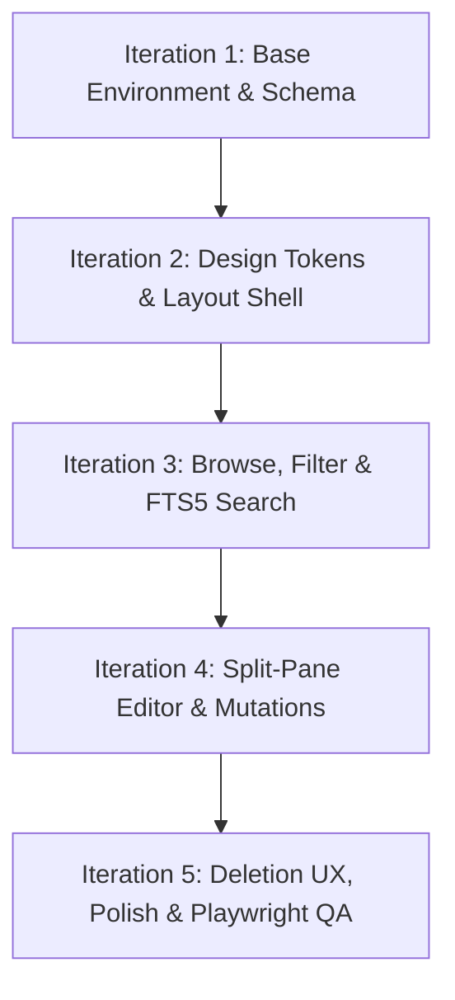

# Implementation Backlog: Simplified Knowledge Base App

This document defines the structured, right-sized execution plan for building the **v1 Simplified Knowledge Base App**. It outlines the MVP scope, sequences the work into logical iterations, addresses critical dependencies, and captures key sequencing and scoping decisions.

---

## 1. MVP Scope Definition

The scope is strictly grounded in the [Product Brief](file:///C:/projects/evals_may2026_gemini-3.5-flash/docs/product-brief.md), [Technical Architecture Specification](file:///C:/projects/evals_may2026_gemini-3.5-flash/docs/architecture.md), and [UX & Design Direction Specification](file:///C:/projects/evals_may2026_gemini-3.5-flash/docs/design-spec.md).

### In-Scope (v1 MVP)
*   **Article Browsing**: Clean, database-driven list view with dynamic filters and robust metadata (category, status, last updated).
*   **Article Detail View**: Responsive, high-readability text canvas (`max-width: 720px`) showing breadcrumbs, breadcrumb navigation, metadata footer, and parsed Markdown content sanitized to prevent XSS.
*   **Full-Text Search (FTS5)**: Keyboard-focused (`Ctrl+K`), sub-millisecond search across article titles and contents, utilizing SQLite's native FTS5 engine, custom triggers for auto-indexing, and BM25 relevance ranking (with title matching boosted 3x).
*   **Split-Pane Markdown Editor**: High-focus client-side workspace featuring 50/50 side-by-side editing and live sanitized markdown rendering (desktop) and toggleable tab view (tablet/mobile). Includes line numbers, line wrapping, debounced parsing (75ms), proportional scroll sync, and dirty-state guards.
*   **Category-Based Organization**: Relational categorization of articles with sidebar navigation filters and database-driven category article counts.
*   **Article Status Handling**: Strict separation of lifecycle states (`draft` vs. `published`), ensuring drafts are kept out of public search results and list views but fully manageable in the editor workspace.
*   **Responsive Multi-Frame Grid**: Adapts dynamically from a 3-column layout (Desktop: persistent 260px sidebar + content pane) to a 2-column layout (Collapsible sidebar + tabbed editor on Tablet) to a 1-column drawer-based layout (Mobile).
*   **Aesthetic Token System**: Adaptive obsidian dark mode and paper-type light mode utilizing curated slate/obsidian HSL tokens.
*   **Testing Infrastructure**: 
    *   **Unit Tests**: Vitest suite validating search cleaning, input sanitization, and Markdown rendering logic.
    *   **E2E Integration Tests**: Playwright cross-browser tests executing the critical user journey (browse -> search -> select -> edit -> save).

### Out-of-Scope (Post-MVP / Stretch)
*   **Collaborative Live Editing**: Multi-user conflict resolution or real-time cursor tracking (requires WebSockets/Yjs).
*   **Authentication & Role-Based Access Control (RBAC)**: Fine-grained user accounts, login screens, or content owner permissions (basic security assumptions are made; SQLite runs locally without auth).
*   **Rich Text WYSIWYG Editor**: Custom blocks or rich text bubble editing (relying on markdown with live side-by-side preview instead).
*   **Category CRUD in Sidebar**: Inline category editing, custom icons, or nested hierarchies.
*   **Revision History & Restores**: Git-like commit histories for articles or article backup reversion systems.

---

## 2. Iteration Plan Overview

The execution is segmented into five focused, sequential iterations. Each iteration leaves the codebase in a fully functional, compilation-safe, and runnable state.

### [Iteration 1: Base Environment, Schema & Seeds](file:///C:/projects/evals_may2026_gemini-3.5-flash/docs/iterations/iteration-1.md)
*   **Goal**: Establish the local development environment, base dependencies, TypeScript/Drizzle config, schema definitions, SQLite/WAL initialization, FTS5 virtual table triggers, and seed data scripts.
*   **Outcome**: A runnable Next.js structure connected to a seeded, WAL-enabled SQLite database with automatically updating search indices.

### [Iteration 2: Core Design System & Persistent Shell](file:///C:/projects/evals_may2026_gemini-3.5-flash/docs/iterations/iteration-2.md)
*   **Goal**: Define styling design tokens, implement adaptive light/dark mode variables, and construct the persistent application header and sidebar navigation layout.
*   **Outcome**: A responsive visual shell that automatically adapts between desktop (3-column grid), tablet (collapsible nav), and mobile (swipe drawer) with full theme switcher support.

### [Iteration 3: Article Browsing, Search, and Category Filtering](file:///C:/projects/evals_may2026_gemini-3.5-flash/docs/iterations/iteration-3.md)
*   **Goal**: Build the core read paths, including the db-driven sidebar category filter, the FTS5 search backend utility, the debounced search list view, empty states, and the high-density article detail page.
*   **Outcome**: A fully functional reading and discovery environment allowing search-first movements from lists to structured detail reviews.

### [Iteration 4: Dynamic Split-Pane Markdown Editor & Operations](file:///C:/projects/evals_may2026_gemini-3.5-flash/docs/iterations/iteration-4.md)
*   **Goal**: Implement article creation and modification workflows using Next.js Server Actions and build the dual split-pane Markdown editor with debounced parsing, scroll sync, and browser dirty-state event guards.
*   **Outcome**: Full authoring capabilities with instant, safe visual feedback in the responsive workspace editor.

### [Iteration 5: Lifecycle Operations, Advanced Polish & Automated E2E Testing](file:///C:/projects/evals_may2026_gemini-3.5-flash/docs/iterations/iteration-5.md)
*   **Goal**: Implement the category deletion cascade warnings and re-assignment workflows, audit all UI interactive states, and run Playwright E2E suites verifying the core user journey.
*   **Outcome**: A production-grade, fully validated, bulletproof knowledge base application.

---

## 3. Dependency and Sequencing Notes

### Critical Path & Blocking Sequence
1.  **Drizzle Schema & FTS5 Triggers** (Iteration 1) **MUST** precede **Browsing & Searching** (Iteration 3) to ensure full-text indexing works seamlessly during reading flows.
2.  **Global Shell & Responsive Navigation** (Iteration 2) **MUST** precede **Browse Lists and Detail Canvas** (Iteration 3) because these views are dynamically mounted inside the persistent `mainPane` container.
3.  **Server Actions & Schema Validations** (Iteration 4) **MUST** precede the **Split-Pane Client Editor** (Iteration 4) to ensure data write flows can compile and save immediately during developer visual validation.
4.  **Category Deletion Cascade Mechanic** (Iteration 5) **MUST** follow **Category/Article Seeding** (Iteration 1) and **Detail View Deletion** (Iteration 3/4) since it introduces advanced data clean-up logic and a dedicated "Uncategorized" filter state.

### Dev Ergonomics and Concurrency
*   All iterations are designed to be run sequentially.
*   Database modifications in Iteration 1 include creating the mock seed file `src/lib/seed.ts` so developers in Iteration 3 and 4 immediately have rich visual content (syntax-highlighted markdown, multiple categories, mixed statuses) to verify rendering layouts.

---

## 4. Stretch and Post-MVP Phasing

Should the product timeline allow, out-of-scope items should be implemented in this sequence:
1.  **Phase 2: Authentication & RBAC**: Integrate NextAuth.js (or standard Auth.js) with the SQLite schema to restrict create/edit/delete actions to authenticated administrators, leaving browse and search public.
2.  **Phase 3: Revision History**: Add an `article_revisions` table that records differences (diffs) whenever an article is updated. Render an interactive list of versions in the detail page's action bar to allow one-click rollbacks.
3.  **Phase 4: Advanced Category CRUD**: Build a drawer in the sidebar navigation with inline forms to create, rename, or recolor category folders without visiting a separate administrative portal.

---

## 5. Decisions Log

### Decision: Scope Categories and Lifecycle Statuses in MVP
*   **Context**: The Product Brief mentions tag organization and article statuses as potential features, but not strictly v1 core. However, both the Design Spec and the Technical Architecture Spec define database schemas, layout matrices, and UI paths that *fully* integrate categories and draft/published badges.
*   **Tradeoff**: Excluding categories/statuses would make the implementation simpler but would lead to massive architecture and UI design gaps (e.g. empty sidebars, missing badges, invalid SQLite foreign key schemas).
*   **Resolution**: Categories and Draft/Published statuses are included as core MVP elements. This satisfies the complete implementation specifications and prevents structural rework in future sessions.

### Decision: synchronous SQLite Bindings with WAL Mode
*   **Context**: Supporting 100 concurrent users with standard SQLite can trigger `database is locked` errors during parallel write operations.
*   **Tradeoff**: Using a separate database engine (PostgreSQL) resolves locks but ruins local developer environment setup ergonomics (requiring Docker/cloud).
*   **Resolution**: Use `better-sqlite3` and explicitly initialize connections with Write-Ahead Logging (`journal_mode = WAL`) and `synchronous = NORMAL` pragmas. This supports hundreds of concurrent reads and concurrent writes with zero infrastructure overhead.

### Decision: Next.js Server Actions over standard JSON APIs
*   **Context**: React Client Components (like the markdown editor) must write modified data back to the SQLite file.
*   **Tradeoff**: Building standard Express/API routing layers introduces REST boilerplates, serialization, and typing divergence.
*   **Resolution**: Implement unified Next.js Server Actions. They run exclusively on the server, interact directly with Drizzle, validate payloads using Zod, and preserve typescript safety across the network boundary automatically.
