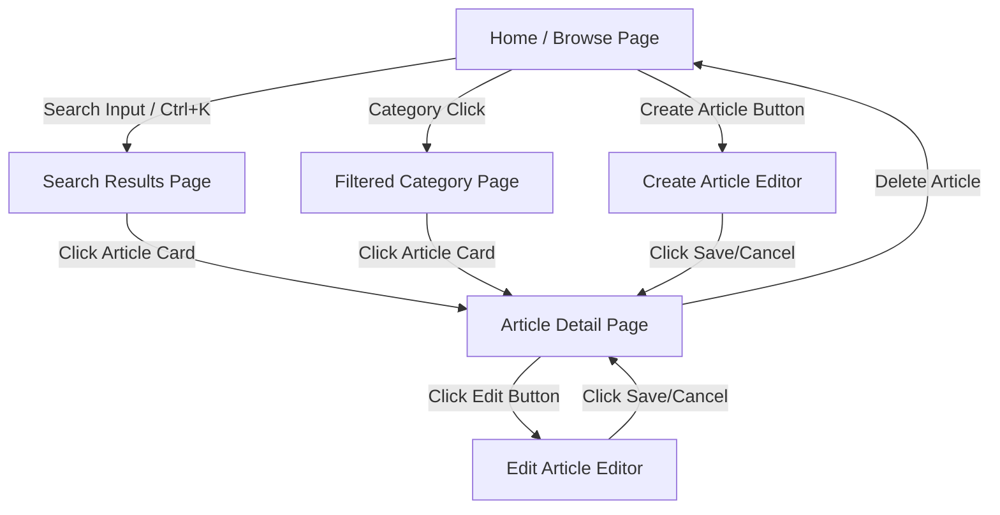

# UX & Design Direction Specification: Simplified Knowledge Base (v1)

This specification defines the complete UX and design system for the **v1 Simplified Knowledge Base App**. It is written as a highly concrete, actionable guide for engineering implementation, eliminating ambiguous layout or interaction design decisions.

---

## 1. Executive Summary & Design System Tone

The interface is built around a **"Premium Minimalist Workspace"** aesthetic. It blends the high-density structure of technical wikis (like Linear, Stripe Docs, and Notion) with a calm, dark/light adaptive color palette, glassmorphism panel interfaces, and smooth micro-animations.

### Core Design Principles:
1. **Legibility & Density Over Decoration**: Prioritize optimal line-heights, letter spacing, and a clean hierarchical layout that keeps knowledge readable and dense.
2. **Search-First Workspace**: Provide instantaneous navigation, global search shortcuts, and low-friction list-to-detail transitions.
3. **Adaptive Visual Calm**: Use a sophisticated, low-fatigue slate/obsidian dark mode as the default experience, paired with a clean paper-like light mode. Accent colors are curated to prevent visual fatigue.
4. **Interactive Responsiveness**: Provide crisp, animated micro-feedback (subtle glows, springy transitions) to make the workspace feel premium, alive, and lightning-fast.

---

## 2. Visual Style System (CSS Design Tokens)

The following tokens are mapped directly to CSS variables to be defined in `src/styles/variables.css`. All interactive components must consume these tokens.

### 2.1 Color Palette (Adaptive HSL Tokens)
We use HSL format to allow easy opacity scaling and smooth theme transitions.

```css
/* src/styles/variables.css */
:root {
  /* Font Families */
  --font-sans: 'Inter', -apple-system, BlinkMacSystemFont, "Segoe UI", Roboto, "Helvetica Neue", sans-serif;
  --font-mono: 'JetBrains Mono', 'Fira Code', 'SF Mono', Consolas, Monaco, monospace;

  /* Theme: Premium Slate Light Mode */
  --bg-primary-hsl: 210, 20%, 98%;      /* #f8fafc */
  --bg-secondary-hsl: 210, 20%, 95%;    /* #f1f5f9 */
  --bg-elevated-hsl: 0, 0%, 100%;       /* #ffffff */
  
  --border-color-hsl: 214, 32%, 91%;    /* #e2e8f0 */
  --border-glow-hsl: 217, 91%, 60%;     /* Focus accent glow */

  --text-primary-hsl: 222, 47%, 11%;    /* #0f172a */
  --text-secondary-hsl: 215, 25%, 27%;  /* #334155 */
  --text-muted-hsl: 215, 16%, 47%;      /* #64748b */

  /* Curated Tech Accents */
  --accent-primary-hsl: 221, 83%, 53%;  /* Cobalt #2563eb */
  --accent-hover-hsl: 224, 76%, 48%;    /* Deep cobalt #1d4ed8 */
  --accent-soft-hsl: 221, 83%, 95%;     /* Soft focus tint #eff6ff */

  /* Lifecycle Statuses */
  --status-draft-bg: hsl(38, 92%, 95%);
  --status-draft-text: hsl(38, 92%, 25%);
  --status-pub-bg: hsl(142, 70%, 95%);
  --status-pub-text: hsl(142, 76%, 22%);
  --status-error-bg: hsl(0, 84%, 96%);
  --status-error-text: hsl(0, 84%, 30%);

  /* Spacing Scale (8pt Grid) */
  --spacing-xxs: 4px;
  --spacing-xs: 8px;
  --spacing-sm: 12px;
  --spacing-md: 16px;
  --spacing-lg: 24px;
  --spacing-xl: 32px;
  --spacing-xxl: 48px;

  /* Border Radius */
  --radius-xs: 4px;
  --radius-sm: 6px;
  --radius-md: 10px;
  --radius-lg: 16px;
  --radius-full: 9999px;

  /* Elevation Shadows */
  --shadow-sm: 0 1px 2px 0 rgba(15, 23, 42, 0.05);
  --shadow-md: 0 4px 6px -1px rgba(15, 23, 42, 0.08), 0 2px 4px -2px rgba(15, 23, 42, 0.08);
  --shadow-lg: 0 10px 15px -3px rgba(15, 23, 42, 0.1), 0 4px 6px -4px rgba(15, 23, 42, 0.1);
  --shadow-focus: 0 0 0 3px rgba(37, 99, 235, 0.2);

  /* Transitions */
  --transition-fast: 0.12s cubic-bezier(0.16, 1, 0.3, 1);
  --transition-normal: 0.22s cubic-bezier(0.16, 1, 0.3, 1);
  --transition-slow: 0.35s cubic-bezier(0.16, 1, 0.3, 1);
}

@media (prefers-color-scheme: dark) {
  :root {
    /* Theme: Deep Obsidian Dark Mode */
    --bg-primary-hsl: 222, 47%, 6%;      /* #0b0f19 - Darker body bg */
    --bg-secondary-hsl: 222, 47%, 10%;   /* #0f172a - Sidebar/Nav */
    --bg-elevated-hsl: 222, 47%, 13%;    /* #1e293b - Main content panels */
    
    --border-color-hsl: 222, 32%, 20%;   /* #1e293b - Thin clean borders */
    --border-glow-hsl: 217, 91%, 65%;

    --text-primary-hsl: 210, 40%, 98%;   /* #f8fafc */
    --text-secondary-hsl: 215, 20%, 80%; /* #cbd5e1 */
    --text-muted-hsl: 215, 16%, 57%;     /* #64748b */

    /* Curated Tech Accents */
    --accent-primary-hsl: 217, 91%, 60%; /* Bright cobalt #3b82f6 */
    --accent-hover-hsl: 217, 91%, 70%;   /* Lighter cobalt #60a5fa */
    --accent-soft-hsl: 217, 91%, 15%;    /* Soft dark cobalt tint */

    /* Lifecycle Statuses */
    --status-draft-bg: hsl(38, 92%, 12%);
    --status-draft-text: hsl(45, 93%, 65%);
    --status-pub-bg: hsl(142, 70%, 10%);
    --status-pub-text: hsl(142, 76%, 70%);
    --status-error-bg: hsl(0, 84%, 12%);
    --status-error-text: hsl(0, 84%, 75%);
  }
}
```

### 2.2 Typography Scale
Optimized specifically for screen readability, reading speed, and hierarchy.

| Size Name | CSS Value | Line Height | Letter Spacing | Purpose |
| :--- | :--- | :--- | :--- | :--- |
| `fs-xs` | `0.75rem` (12px) | `1.5` | `+0.01em` | Metadata, badges, input hints |
| `fs-sm` | `0.875rem` (14px) | `1.5` | `0` | Sidebar links, secondary table info, button text |
| `fs-base`| `1.00rem` (16px) | `1.6` | `-0.011em` | Standard body text, editor content, primary text |
| `fs-md` | `1.125rem` (18px) | `1.6` | `-0.015em` | Sub-headers, article card titles, preview highlights |
| `fs-lg` | `1.25rem` (20px) | `1.5` | `-0.018em` | Category titles, Section headers, Modal titles |
| `fs-xl` | `1.50rem` (24px) | `1.4` | `-0.021em` | H2 headers, secondary section titles |
| `fs-xxl` | `2.00rem` (32px) | `1.3` | `-0.022em` | H1 main article title, main dashboard greetings |

---

## 3. Layout & Page Flows

The app operates on a **Single-Frame Dynamic Split** layout. Next.js layout features are utilized to ensure the sidebar and global header remain mounted and static, while the main workspace panel swaps views asynchronously with animated opacity shifts.

```
┌────────────────────────────────────────────────────────┐
│ [LOGO] KB   [  Search... (Ctrl+K)                   ]  │ <-- Persistent Header (1px border-bottom)
├─────────────┬──────────────────────────────────────────┤
│             │                                          │
│  Sidebar    │  Main Content Pane                       │
│  (Nav)      │  (Dynamic Routing)                       │
│  260px      │                                          │
│             │  ┌────────────────────────────────────┐  │
│ - Category1 │  │ Article Detail View                │  │
│ - Category2 │  │ or Search Results List             │  │
│ - Category3 │  │ or Split-Pane Markdown Editor      │  │
│             │  └────────────────────────────────────┘  │
│             │                                          │
└─────────────┴──────────────────────────────────────────┘
```

### 3.1 Screen Layouts

#### Screen A: Browse & Search List View
The landing point and fallback search interface. Highly data-dense.
*   **Header Indicators**: Shows active query details, e.g., "Search Results for 'Node'" or "Category: Engineering" along with a matching article count badge.
*   **Article Row Card**:
    *   Title (`fs-md`, Semi-Bold).
    *   One-line description/snippet (`fs-base`, `text-secondary`, line-clamp 1).
    *   Metadata row: Category badge, status badge (`Draft` / `Published`), and date modified ("Last updated 2 days ago").
*   **Empty State Layout**: If no articles exist or matching results are empty:
    *   Vibrantly rendered calm illustration overlay (created with absolute CSS shapes).
    *   Explicit action button ("Create New Article" or "Clear Search Filters").

#### Screen B: Article Detail View
The high-readability page optimized for document review.
*   **Breadcrumbs**: `Category Name` > `Article Title`. Clickable breadcrumbs for navigating backward.
*   **Action Row (Sticky Top)**:
    *   "Edit Article" primary button (Tech cobalt outline, transitions to full color on hover).
    *   Article Status Badge (Pill styling: `Draft` / `Published`).
    *   "Delete" icon button (red hover trigger with confirmation dialog).
*   **Main Text Canvas**: Centered document container (`max-width: 720px`).
    *   Title in `fs-xxl` bold.
    *   Metadata footer: Modified date, category link, character count, estimated read time.
    *   Markdown Render Pane: Customized headings (h1, h2, h3), code blocks with JetBrains Mono background, blockquotes, and tables styled with thin borders.

#### Screen C: Create & Edit Article View
The high-focus markdown editor. It uses a **50/50 split view** on large desktops and stacked cards on smaller tablets/laptops.
*   **Metadata Header Bar**:
    *   Title Input: Large borderless text field (`fs-xl` bold) with subtle placeholder.
    *   Category Dropdown: Clean select wrapper with chevron.
    *   Status Dropdown: Draft/Published toggle control.
    *   Action Buttons: "Cancel" (neutral text button) and "Save Changes" (elevated Cobalt button).
*   **Split Workspace**:
    *   **Left Pane (Editor)**: Text area using `var(--font-mono)`, matching standard IDE padding, with line numbers and line-wrapping active.
    *   **Right Pane (Preview)**: Read-only live rendering of the parsed markdown. Uses a subtle background shade (`var(--bg-secondary-hsl)`) and matching layout spacing to let the user see exactly how the published layout will look.

### 3.2 Navigation & Transition Diagram


---

## 4. Feature UX Decisions & Interaction Design

### 4.1 Instant Debounced Search Focus
*   **Keyboard Shortcut**: Pressing `Cmd + K` (Mac) or `Ctrl + K` (Windows) instantly focuses the global search input, highlighting any current text.
*   **Live Overlay Indicator**: When focused, a search overlay displays a quick list of "Recent Articles" or "Popular Keywords" underneath before the user starts typing.
*   **Input Debounce**: Key presses are debounced by `200ms`. When typing stops, a Next.js soft navigation updates the URL query string (`/articles?search=query`), updating the list view via Server Actions without a full browser reload.

### 4.2 Split-Pane Markdown Editor Sync
*   **Debounced Parser**: Text changes in the textarea are parsed by `marked` and sanitized by `DOMPurify` with a debounced interval of `75ms`. This avoids input lag and preserves fluid key inputs even on low-end machines.
*   **Scroll Synchronization**: Scroll offsets are synced dynamically between the Editor pane and the Preview pane. When the developer scrolls the editor, the preview scrolls proportionally to show matching sections.
*   **Dirty State Guard**: If the user has unsaved edits in the editor and attempts to click a sidebar link or refresh the page, an browser alert confirmation is triggered: *"You have unsaved changes. Are you sure you want to leave this page?"*

### 4.3 Category Cascade Deletion UX
*   **Mechanic**: If a user attempts to delete a Category, a confirmation modal explains the cascade consequence: *"This category will be permanently removed. The [X] articles inside will not be deleted; they will become Uncategorized."*
*   **Reversion Option**: Uncategorized articles can be selected from a dedicated "Uncategorized" category filter group at the bottom of the sidebar to allow rapid reassignment.

---

## 5. Responsive Design & Mobile Adaptations

To support tablet and mobile screen dimensions, the application scales down from a multi-pane layout to a clean single-pane drawer architecture.

### 5.1 Breakpoints

| Breakpoint Name | CSS Rule | Layout Architecture Changes |
| :--- | :--- | :--- |
| **Desktop** | `>= 1024px` | 3-Column Grid: Persistent Sidebar (260px) + Shell Content. Editor is a 50/50 side-by-side split. |
| **Tablet** | `768px - 1023px`| 2-Column Grid: Sidebar is collapsible via a toggle button. Editor switches from side-by-side to a toggleable Tab View: `[Write Markdown]` \| `[Preview Output]`. |
| **Mobile** | `< 768px` | 1-Column Grid: Sidebar is hidden behind an overlay drawer (sliding from left). Search is a full-screen input modal. Bottom actions bar is sticky for easy thumb access. |

### 5.2 Touch Targets & Mobile Specifics
*   **Touch Target Minimum**: All interactive buttons, nav list items, and status indicators have a minimum touch target area of **48px x 48px** on screens `< 768px` (accomplished using visual padding inside transparent boundaries).
*   **Interaction Gestures**:
    *   **Sidebar Navigation**: Swipe right from the left screen edge opens the category drawer. Swipe left anywhere on the open drawer collapses it.
    *   **Tab switching**: Users can swipe horizontally in the mobile editor to swap between editor text and live HTML preview.

---

## 6. Comprehensive UI States Matrix

Every component must support the states detailed below. Hover effects utilize a subtle transition delay and scale scaling to feel organic.

```
                  ┌───────────────┐
                  │ DEFAULT STATE │
                  └───────┬───────┘
                          │
            ┌─────────────┼─────────────┐
      Hover │       Focus │       Error │ Active/Selected
      ┌─────▼─────┐ ┌─────▼─────┐ ┌─────▼─────┐ ┌─────▼─────┐
      │  Scale +  │ │   Focus   │ │ BorderRed │ │ Accent Bg │
      │ BoxShadow │ │ Outline & │ │   Shake   │ │ TextWhite │
      │ AccentBrd │ │ AccentGlow│ │ AlertIcon │ │  GlowBrd  │
      └───────────┘ └───────────┘ └───────────┘ └───────────┘
```

### 6.1 State Styling Rules

#### Buttons (Primary / Cobalt)
*   **Default**: Background `hsl(var(--accent-primary-hsl))`, text `white`, shadow `var(--shadow-sm)`.
*   **Hover**: Background `hsl(var(--accent-hover-hsl))`, transform `translateY(-1px)`, shadow `var(--shadow-md)`.
*   **Focus**: `outline: none`, `box-shadow: var(--shadow-focus)`.
*   **Active (Pressed)**: Background `hsl(var(--accent-hover-hsl))`, transform `translateY(0)`.
*   **Disabled**: Background `hsl(var(--text-muted-hsl) / 0.2)`, text `hsl(var(--text-muted-hsl))`, cursor `not-allowed`, opacity `0.6`.
*   **Loading**: Displays a spinning inline SVG indicator, text is hidden, click handler is locked.

#### Text Inputs & Textareas
*   **Default**: Background `hsl(var(--bg-elevated-hsl))`, border `1px solid hsl(var(--border-color-hsl))`, border-radius `var(--radius-md)`.
*   **Hover**: Border color `hsl(var(--text-muted-hsl))`.
*   **Focus**: Border color `hsl(var(--accent-primary-hsl))`, `box-shadow: var(--shadow-focus)`.
*   **Error**: Border color `hsl(var(--status-error-text))`, background `hsl(var(--status-error-bg))`.
*   **Disabled**: Background `hsl(var(--bg-secondary-hsl))`, opacity `0.7`.

#### Sidebar Category Navigation Items
*   **Default**: Background `transparent`, text `hsl(var(--text-secondary-hsl))`, border-left `2px solid transparent`.
*   **Hover**: Background `hsl(var(--border-color-hsl) / 0.4)`, text `hsl(var(--text-primary-hsl))`.
*   **Selected / Active**: Background `hsl(var(--accent-soft-hsl))`, text `hsl(var(--accent-primary-hsl))`, border-left `2px solid hsl(var(--accent-primary-hsl))`, font-weight `600`.

#### Article Cards (Browse List)
*   **Default**: Background `hsl(var(--bg-elevated-hsl))`, border `1px solid hsl(var(--border-color-hsl))`, transition `all var(--transition-normal)`.
*   **Hover**: Border color `hsl(var(--accent-primary-hsl) / 0.4)`, transform `translateY(-2px)`, shadow `var(--shadow-md)`.
*   **Active**: Transform `translateY(0)`, shadow `var(--shadow-sm)`.

---

## 7. Accessibility (a11y) Implementation Specs

This specification targets Web Content Accessibility Guidelines (WCAG) **2.1 Level AA** compliance.

### 7.1 Keyboard Shortcuts & Navigation Flow

*   **Keyboard Action Keys**:
    *   `Ctrl + K` or `Cmd + K`: Focus global search.
    *   `Esc` (inside search): Blur search and hide overlay.
    *   `Ctrl + S` or `Cmd + S` (inside editor): Save article (submits Server Action).
    *   `Tab` navigation follows DOM flow sequentially:
        1. Search input -> 2. Category list navigation -> 3. New Article trigger -> 4. Article list cards -> 5. Detail pane action buttons.

*   **Focus Ring Indicator**:
    *   A generic focus ring is forbidden. Instead, use an explicit `3px` glowing border calculated with:
        `box-shadow: 0 0 0 3px hsla(var(--accent-primary-hsl), 0.25);`
        `border-color: hsl(var(--accent-primary-hsl));`

### 7.2 Semantic Markup & ARIA Specifications

*   **HTML Landmark Structure**:
    *   Sidebar: Wrap in `<nav aria-label="Main Category Navigation">`.
    *   Header: Wrap in `<header role="banner">`.
    *   Main Content Pane: Wrap in `<main id="main-content" tabIndex="-1">` (allows quick skipping from skip-links).
    *   Article Content: Wrap in `<article>`.

*   **Interactive Controls**:
    *   Markdown Editor Textarea: must have `aria-label="Markdown Article Editor"`.
    *   Live Preview Pane: must have `aria-live="polite"` and `aria-label="Live HTML Preview"`.
    *   Status badges: Must feature screen-reader metadata: `<span class="badge published"><span class="sr-only">Article Status: </span>Published</span>`.

---

## 8. Developer Handoff Notes & Code Skeletons

To guarantee exact structural layout execution, use the following HTML structure skeletons and class namings.

### 8.1 Core Page Layout Skeleton

```html
<!-- src/app/layout.tsx -->
<div class="shellContainer">
  <!-- Persistent Header Banner -->
  <header class="globalHeader" role="banner">
    <div class="logoGroup">
      <a href="/" class="logoLink" aria-label="Knowledge Base Home">
        <span class="logoIcon">📚</span>
        <span class="logoText">TeamKB</span>
      </a>
    </div>
    
    <div class="searchWrapper">
      <span class="searchIcon" aria-hidden="true">🔍</span>
      <input 
        type="search" 
        id="global-search" 
        placeholder="Search articles... (Ctrl+K)" 
        aria-label="Search articles"
      />
      <span class="kbdBadge" aria-hidden="true">Ctrl K</span>
    </div>
  </header>

  <!-- Sidebar & Main Content Grid -->
  <div class="layoutGrid">
    <aside class="sidebarNav" role="complementary">
      <nav aria-label="Category Navigation">
        <div class="sidebarHeader">
          <h3>Categories</h3>
          <button class="addCategoryBtn" aria-label="Add Category">+</button>
        </div>
        <ul class="categoryList">
          <li>
            <a href="/articles?category=engineering" class="categoryItem active">
              <span class="categoryIcon">📁</span>
              <span class="categoryName">Engineering</span>
              <span class="articleCount">12</span>
            </a>
          </li>
          <li>
            <a href="/articles?category=product" class="categoryItem">
              <span class="categoryIcon">📁</span>
              <span class="categoryName">Product</span>
              <span class="articleCount">5</span>
            </a>
          </li>
        </ul>
      </nav>
    </aside>

    <!-- Asynchronously Swapped Main Container -->
    <main id="main-content" class="mainPane" tabindex="-1">
      <!-- Dynamic Screen Children Render Here -->
    </main>
  </div>
</div>
```

### 8.2 Split-Pane Editor Structural Skeleton

```html
<!-- src/components/MarkdownEditor.tsx -->
<div class="editorWorkspace">
  <!-- Editing Control Row -->
  <div class="metaRow">
    <div class="inputGroup titleGroup">
      <label for="editor-title" class="sr-only">Article Title</label>
      <input 
        id="editor-title"
        type="text" 
        class="titleInputField" 
        placeholder="Enter descriptive article title..."
      />
    </div>
    
    <div class="controlSelectors">
      <select id="editor-category" aria-label="Select Category">
        <option value="">No Category</option>
        <option value="1">Engineering</option>
      </select>
      
      <select id="editor-status" aria-label="Select Status">
        <option value="draft">Draft</option>
        <option value="published">Published</option>
      </select>
      
      <button class="saveChangesButton" type="submit">
        Save Changes
      </button>
    </div>
  </div>

  <!-- Interactive 50/50 Code Editor Workspace -->
  <div class="splitViewContainer">
    <div class="textareaWrapper">
      <label for="markdown-textarea" class="sr-only">Markdown Input</label>
      <textarea 
        id="markdown-textarea"
        class="markdownTextArea"
        placeholder="Start writing in Markdown..."
      ></textarea>
    </div>
    
    <div 
      class="livePreviewPane"
      aria-live="polite"
      aria-label="Rendered Markdown Preview"
    >
      <!-- HTML injected here via DOMPurify + marked -->
    </div>
  </div>
</div>
```

---

## 9. UX Decisions & Tradeoffs Log

1. **Split-Pane View vs. Tabbed View Editor**:
   *   *Tradeoff*: Split-pane editing requires double the horizontal real-estate, which can look crowded on smaller screens, but is the gold standard for developer editors because it minimizes the context-switch of clicking tabs.
   *   *Resolution*: Implemented dynamic media queries. Large desktops (`>= 1024px`) receive the 50/50 side-by-side view. Tablets and smaller devices automatically fold the layout into a tabbed layout (`Edit` \| `Preview`), keeping the touch area clear and text input legible.
   
2. **Search-in-Header vs. Search-in-Sidebar**:
   *   *Tradeoff*: Placing search in the sidebar groups controls together, but limits the input width. Placing search in the header gives ample horizontal space, allowing quick preview popovers.
   *   *Resolution*: Positioned search in the center of the global header. This establishes a "Search-First" hierarchy and provides horizontal room for a structured popup displaying recent documents or real-time query match previews.

3. **Autosave vs. Manual Action Save**:
   *   *Tradeoff*: Autosaving markdown text prevents data loss but can generate excessive SQLite WAL file writes and index churn during typing.
   *   *Resolution*: Implemented manual Save action via a highlighted Cobalt button and standard shortcut (`Ctrl + S`), paired with a robust browser dirty-state event guard to protect unsaved local inputs. This balances zero-latency performance with robust data safety.
